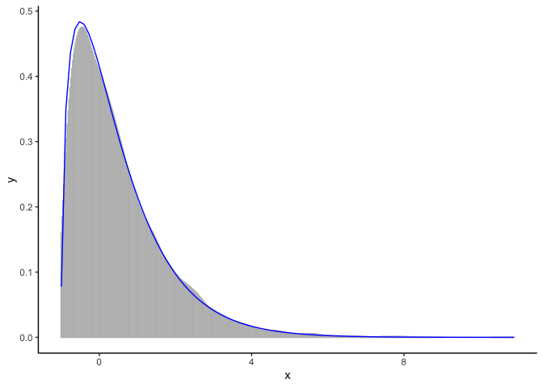

<!-- README.md is generated from README.Rmd. Please edit that file -->

# lsf: location-scale families in R

<!-- badges: start -->
<!-- badges: end -->

This R package provides a simple interface to define a [location-scale
family](http://www.randomservices.org/random/special/LocationScale.html)
from a standard probability distribution.

## Installation

lsf has no releases yet. You can install the development version from
[GitHub](https://github.com/) with:

``` r
# install.packages("remotes")
remotes::install_github("tabe/lsf")
```

## Example

The following code shows a simplest example of what lsf can do.

``` r
library(lsf)
library(ggplot2)

obj <- lsf("chisq", .location = -1, .scale = 0.5)
r <- r_(obj)
data <- r(10000, df = 3)

f <- function(x) {
    dchisq((x + 1) / 0.5, df = 3) / 0.5
}

ggplot(data.frame(x = data), aes(x = x)) +
    geom_bar(stat = "density", colour = "grey") +
    stat_function(fun = f, colour = "blue") +
    theme_classic()
```



## License

GPLv3
